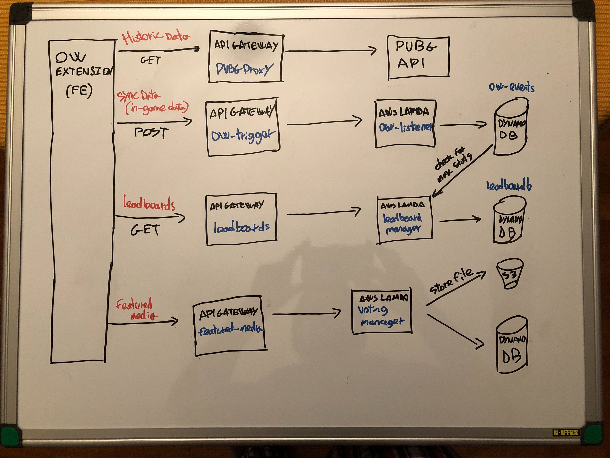

# AWS backend
  - **API Gateway** as a proxy for PUBG API in order to hide the PUBG API token.
  - **API Gateway** that triggers **AWS Lambda** functions to read/write realtime ingame data in **AWS DynamoDB**. 

###### Main structure - v1.1.0

